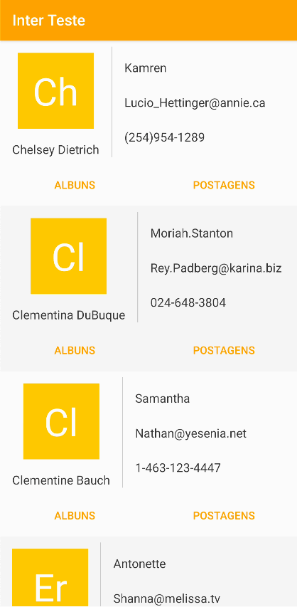

## Objetivo

Realizar uma refatoração que melhore as técnicas de programação e arquitetura utilizando tecnologias mais atuais.

## O que deve ser entregue

O aplicativo funcionando exatamente como está na versão original. O comportamento e o visual não devem ser alterados. O layout técnicamente pode ser alterado para seguir boas práticas e visando performance.

Publique o resultado da sua refatoração em um repositório público aqui mesmo no GitHub.

## O que gostaríamos que fosse utilizado

- Preferência por Kotlin
- Arquitetura de software em camadas (Seguir os princípios de arquitetura do Android Jetpack)
- Injeção de dependência (Manual ou utilizando Koin https://insert-koin.io/)
- Single-activity architecture
- Constraint Layout
- Databinding ou viewbinding
- Navigation
- Groupie (https://github.com/lisawray/groupie)
- Coroutines
- Testes unitários
- App funcionando simulando dispositvos com baixa memória (don't keep activity)

Você não precisa entregar todos os pontos acima. Faça a refatoração de acordo com os seus conhecimentos.

## Aplicação

